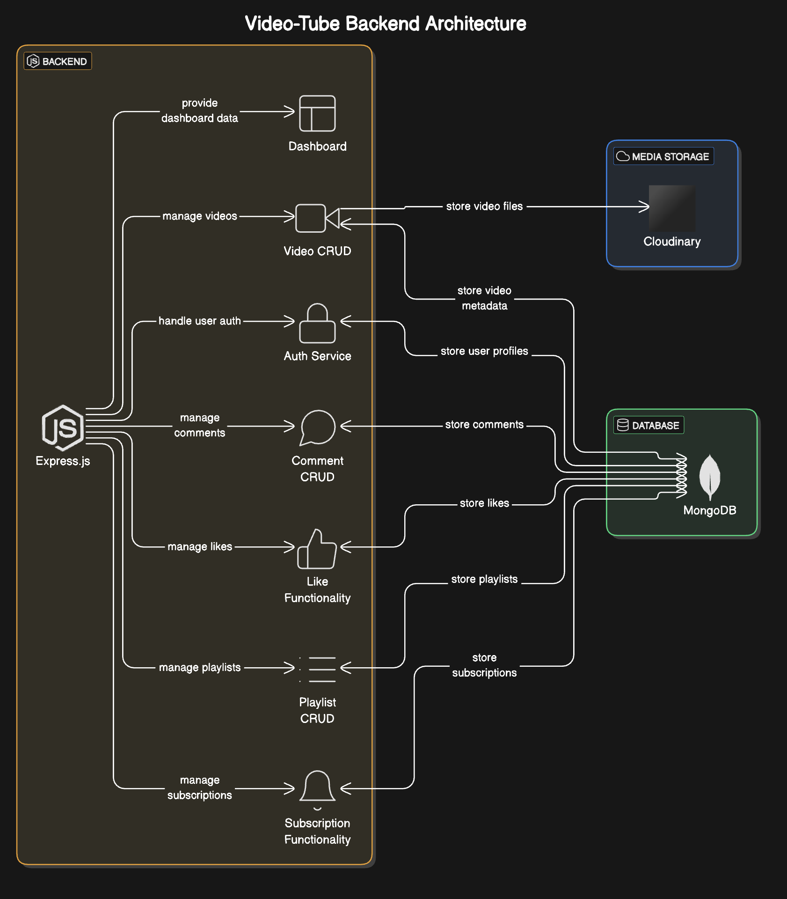

## Table of Contents
- [Overview](#overview)
- [System Architecture](#system-architecture)
- [Key Features](#key-features)
- [Tech Stack](#tech-stack)
- [Installation](#installation)
- [API Testing with Postman](#api-testing-with-postman)
- [Resources](#resources)

## Overview
This project is a robust backend built with ExpressJS and MongoDB, designed to handle a variety of operations for a social media-like platform.
I built this entire project in public, sharing every step of the development process.
You can follow along with the complete explanation in this [YouTube playlist](https://www.youtube.com/playlist?list=PLGMuWOX9e5MrXlnQ4tO8t7n3IDTIalRjt).

## System Architecture


## Key Features:
- Manage registration, login, logout, and other user-related functionalities.
- Allows users to perform CRUD operations on videos.
- Users can create, read, update, and delete comments 
- Enables users to like videos, comments
- Dashboard Functionality
- Playlist CRUD operations
- Subscription Functionality

## Tech Stack:
- Node.js
- JavaScript
- Express.js
- MongoDB
- Cloudinary
  
## Installation:

Follow these steps to get the project set up on your local machine:

1. **Clone the repository**: First, you will need to clone the repository to your local machine. You can do this with the following command:

    ```bash
    git clone https://github.com/Rakib-Hasan25/VideoTube-Backend.git
    ```

2. **Navigate to the project directory**: Change your current directory to the project's directory:

    ```bash
    cd VideoTube-Backend
    ```

3. **Install the dependencies**: Now, you can install the necessary dependencies for the project:

    ```bash
    npm install -g nodemon
    npm install

    ```

4. **Set up environment variables**: Copy the `.env.example` file and rename it to `.env`. Then, fill in the necessary environment variables.

5. **Start the server**: Finally, you can start the server:

    ```bash
    npm run dev
    ```
    
## API Testing with Postman

To make testing the API easier, I've included a ready-to-use Postman collection.

📁 [Download the Postman Collection](./videotube.postman_collection.json)

### How to Use

1. Download the JSON file above.
2. Open [Postman](https://www.postman.com/).
3. Click `Import` > `File` and select `videotube.postman_collection.json`.
4. Start testing the API!

The collection includes all key endpoints with example requests and necessary headers.

## Resources:
- MongoDB Aggregation Pipeline
- Javascript 
- Packages


